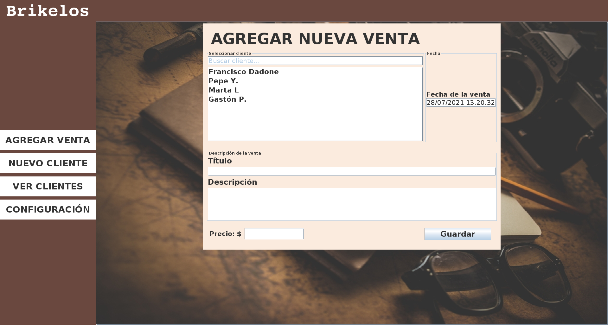
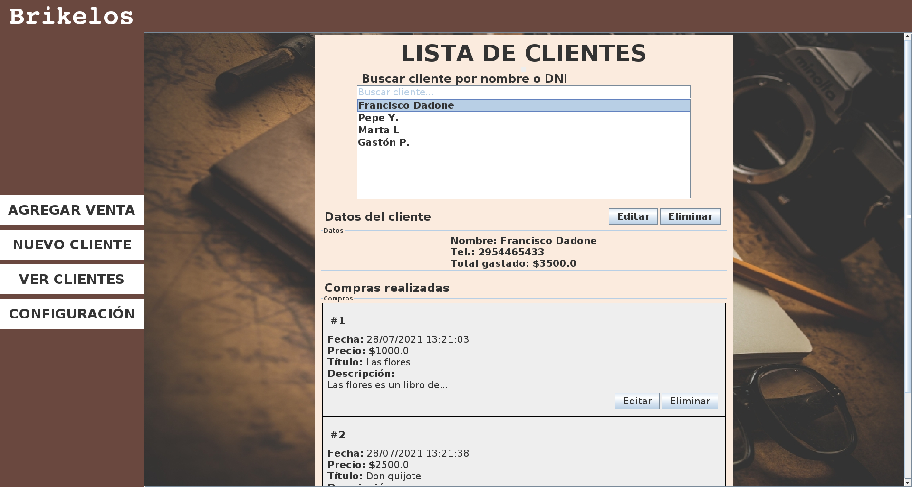
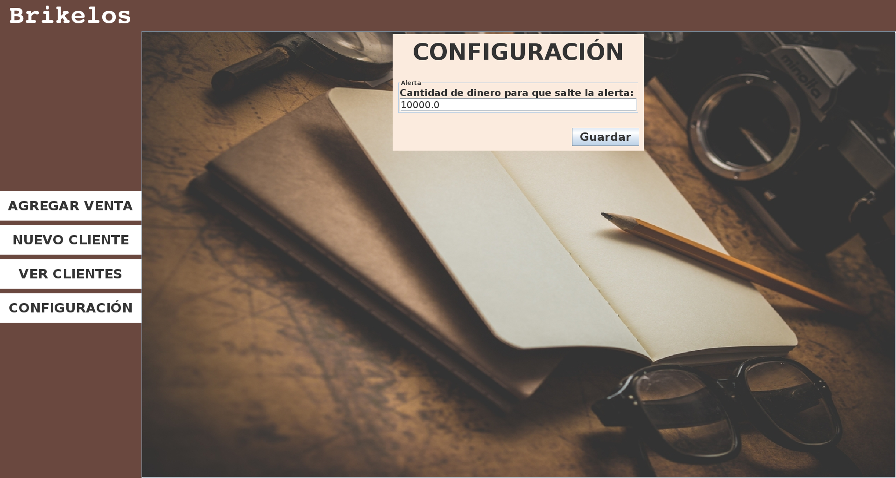
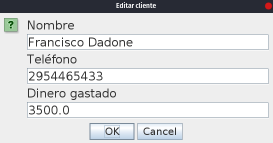
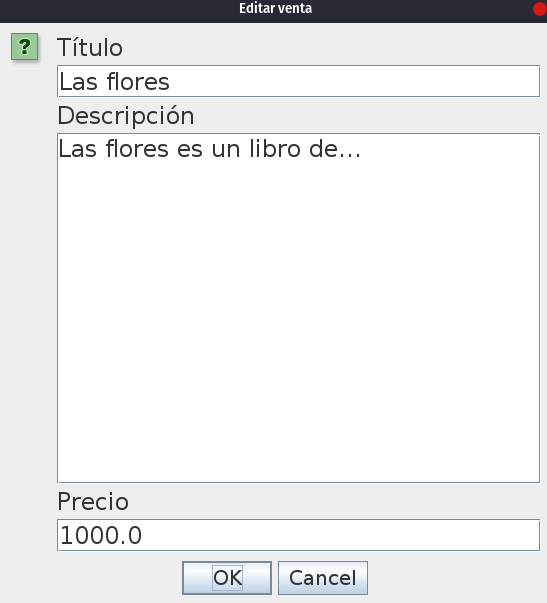

# Brikelos
Aplicación de gestión de clientes para la librería Brikelos de Santa Rosa, La Pampa.

Desde la app se pueden agendar clientes, agregar una venta, editar clientes y ventas, ver la lista de clientes y listar sus compras.

También existe la pestaña configuración en la cual se puede poner un monto de dinero en el cual salte una notificación si el cliente llegó a esa cífra.

### Imágenes:
- Agregar venta
   

- Agregar cliente
  
  
- Lista de clientes
  
  
- Configuración
  
  
- Editar clientes
  
  
- Editar ventas
  