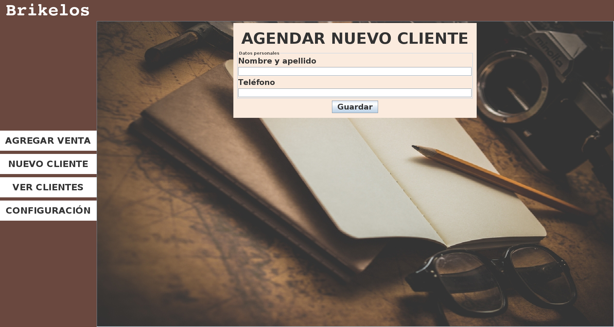

# Brikelos
Aplicación de gestión de clientes para la librería Brikelos de Santa Rosa, La Pampa.

Desde la app se pueden agendar clientes, agregar una venta, editar clientes y ventas, ver la lista de clientes y listar sus compras.

También existe la pestaña configuración en la cual se puede poner un monto de dinero en el cual salte una notificación si el cliente llegó a esa cífra.

Está implementada una base de datos remota usando MongoDB para hacer una copia de seguridad de la base local y a su vez recuperar toda la información del remoto al local en caso de pérdida de datos.

## Configuración de la base de datos remota
El fichero de configuración se encuentra dentro de 'Home/Brikelos/database/mongoCredentials.yml' o en windows 'Documents/Brikelos/database/mongoCredentials.yml'. Ahí hay que rellenar los campos según los datos de la base de datos. (Recomendación: https://cloud.mongodb.com/)

### Imágenes:
- Agregar venta
   

- Agregar cliente
  
  
- Lista de clientes
  
  
- Configuración
  
  
- Editar clientes
  
  
- Editar ventas
  
  
- Pérdida de datos del local (Recuperar del remoto)
  